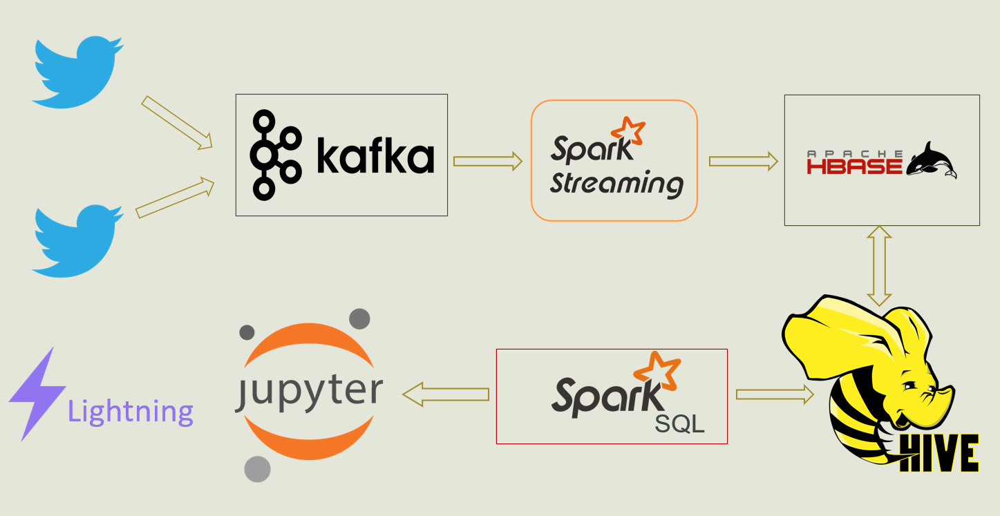
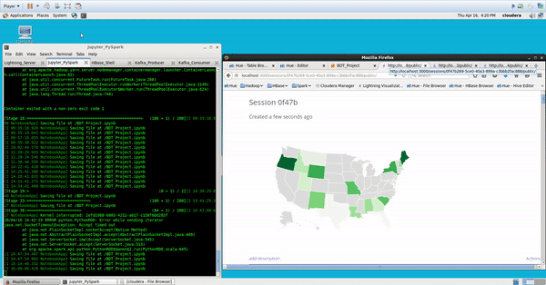

## Realtime Twitter feed map analyzer for the US during COVID19

[](https://github.com/ahmedhamdy90/deep-learning-specialization-coursera/blob/master/LICENSE)

This project will show an auto-updated map with the people interaction during COVID19 in the US using big data technologies to analysis a real-time stream of Twitter data. **This project is a work of 3 people (me and two other teammates)**, original project repo is at Bitbucket. 



---

## How to import the project into eclipse

1. Make sure that you have maven installed in your local machine.
2. Clone the repository from eclipse '**git**' perspective.
3. Import the project.
4. Right click on the project and select '**Maven -> Update Project**' check '**Force Update...**'
5. Go to the project home directory and execute the following in the terminal:   
	$ `mvn clean install`   
	$ `mvn package`
6. Go to the download location of the 'l**ombok-xxx.jar**' jar file in the '.**m2**' folder.
7. From the terminal execute:   
	$ `java -jar lombok-1.16.18.jar`
8. Follow the steps found on **[this website](https://howtodoinjava.com/automation/lombok-eclipse-installation-examples/)**.
9. Repeat step 4 again after restarting eclipse.

---

## Prepare your VM environment

1. [Install Kafka](https://blog.clairvoyantsoft.com/installing-apache-kafka-on-clouderas-quickstart-vm-8245d8d0ebe5).

	1.1. If you are working with Cloudera VM, then:   
	1.2. Navigate to the Desktop and Execute the '**Migrate to Parcels**' script.   
	1.3. Install Kafka (from **[this link](http://archive.cloudera.com/kafka/parcels/3.1.1/)** for **Cloudera VM  5.13**).   

	**Optional steps**   
	1.4. If step 1.2. stucked, then you can activate **Parcels** from [CM](http://quickstart.cloudera:7180/cmf/home).   
	1.5. Click on **Parcels** icon on the top right.   
	1.6. Find **CDH 5** and activate it.   
	
2. Create a new topic:   
`kafka-topics --create --zookeeper quickstart.cloudera:2181 --replication-factor 1 --partitions 3 --topic covid-tweets`

3. Verify if the topic is created:   
`kafka-topics --zookeeper quickstart.cloudera:2181 --list`

4. Run some smoke test for producer/consumer:   
	4.1. Open a new console, start producer:   
		`kafka-console-producer --broker-list quickstart.cloudera:9092 --topic covid-tweets`   
	4.2. Open a new console, start consumer:   
		`kafka-console-consumer --zookeeper quickstart.cloudera:2181 --topic covid-tweets --from-beginning`   
	4.3. Now try to type something on your producer and see if the message comming in consumer.   
	4.4. Exit both consoles.

---

## Building and Getting Ready

1. Go to the project directory.
2. Execute  `mvn package` in the terminal.
3. Get the file **streamdata-0.0.1-SNAPSHOT-jar-with-dependencies.jar** from target foler.
4. Create Hive table based on Hbase table (found in **commands/hive.sql**):   
`hive -f hive.sql`

---

## Installing Jupyter

Please find the script to install Jupyter in '**commands/Setup_Jupyter.sh**'   
`bash Setup_Jupyter.sh`

To run the notebook in a new console window:   
`pyspark`

More information about Jupyter can be found in the main [website](https://jupyter.org/) and more example about Jupyter and Lightning integration can be found [here](https://nbviewer.jupyter.org/github/lightning-viz/).

---

## Install Lightning Visualization Server

Please find the script to install Lightning Server in '**commands/Setup_Lightning.sh**'   
`bash Setup_Lightning.sh`

To run the server in a new console window:   
`nvm use v6.3.0 `   
`lightning-server `

More information about Lightning can be found in the main [website](http://lightning-viz.org/) and the API can be found [here](http://lightning-viz.org/lightning-python/api.html).

---

## Start Twitter Kafka Producer(P4), Twitter Spark Streaming consumer (P1) and Spark SQL for data analysis(P2)

**Note that:** you need to get a Twitter developer key first.

Follow the below steps, at your working folder, after getting the jar mentioned at section **Building and Getting Ready**.

**Step 1:**   
Start Twitter Kafka producer at a new console window.

Data is streaming directly from Twitter and filter by hashtag **#COVID19**, **#coronavirus** and by location in **USA**.

Streaming data is put into Kafka brocker by using Kafka producer.

```
spark-submit --class "bdt.streamdata.TwitterKafkaProducerApp" --master yarn streamdata-0.0.1-SNAPSHOT-jar-with-dependencies.jar
```

**Step 2:**   
Start Twitter Spark Streaming consumer at a new console window.

Spark Streaming getting data from kafka as a consumer subscribes to a Kafka topic.

It processes the data and saves it into HBase.

```
spark-submit --class "bdt.streamdata.TwitterKafkaConsumerApp" --master yarn streamdata-0.0.1-SNAPSHOT-jar-with-dependencies.jar
```

**Optional Step 3:**   
Start Spark SQL for data analysis in a new console window.

Using Spark SQL and HiveSQL to get the data from HBase and compute data

```
spark-submit --class "bdt.streamdata.TwitterAnalysisApp" --master yarn streamdata-0.0.1-SNAPSHOT-jar-with-dependencies.jar
```

**Step 4:**   
Run the Jupyter notebook, and check the map at Lightning server, the map is auto-updating around every 2 mins (**depending on the machine**) with the highest number of tweets per state about COVID19 (darker state color means more tweets).


